### Hi I'm Xinyu 👋

- 🔭 I’m currently working at [Bytedance](https://github.com/bytedance).
- 🌱 I’m currently learning Graph-Embedding/NLP and more.
- ✨ Recently I'm interested in LLM, and here is some [Modest Understandings on LLM](https://bytedance.feishu.cn/docx/doxcn3zm448MK9sK6pHuPsqtH8f)
- 💬 Ask me about
  - 🐍 Python
  - 🚀 CUDA/C++
  - 🐛 Write bugs
- 📫 How to reach me: yangxinyu.715@bytedance.com
- 📺 Bilibili: [小杨不努力0v0](https://space.bilibili.com/1564408396)
- ⚡ Fun fact: My cat's name is Aphelios, which happens to be the name of my favorite hero in League of Legends.

  
  

Cards are generated daily by [GitHub Readme Stats Action](https://github.com/stats-organization/github-readme-stats-action).
